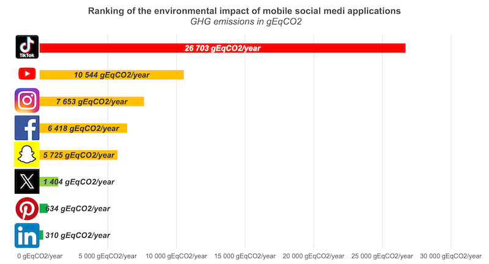

## Social media usage among the French

According to the France 2024 "We Are Social" report, French people are more connected than ever, with over 97% of the population aged 16-64 owning a smartphone. This number keeps increasing every year (+1% compared to 2023). One of the main uses of these devices is social media platforms. 78% of French people use them regularly, visiting an average of 6 different platforms per month. The top three most popular platforms are Facebook, WhatsApp, and Instagram.

Although more connected and active on social media, French people spent less time on these platforms than last year, with an average of 1h48 per day, which is 7 minutes less. Unfortunately, this hides a lot of disparities. TikTok broke all records this year with an average time spent on the app by active users of 38h38, an increase of more than 12%! Knowing the algorithm behind this app and the proportion of 13-17-year-olds (28%) using it, this is concerning!

## Environmental impact of social media

Based on the technique documented by [Greenspector](https://greenspector.com/fr/quelle-empreinte-environnementale-pour-les-applications-reseaux-sociaux-edition-2023/) to evaluate the environmental impact in 2023, I’ve updated the numbers for 2024, assuming that social media publishers have not improved the efficiency of their platforms.

### User journey evaluated by Greenspector

The same user journey was used to measure the environmental impact of the platforms:
- Step 1: launching the app
- Step 2: reading the news feed without scrolling (30 sec)
- Step 3: scrolling through the news feed with interspersed pauses
- Step 4: putting the app in the background (30 sec)

### User journey evaluation results

According to Greenspector, LinkedIn is the least impactful app, with very little data exchanged between user devices and servers, and low energy consumption (13mAh), 15% lower than other apps tested. TikTok came in last, being very energy-consuming at launch with 22mAh consumed. Its data usage is phenomenal (around 5 MB) as it preloads all videos and photos within 30 seconds after launching for offline use.


Greenspector’s parameters for calculating the environmental impact of their user journey are:
- three iterations measuring energy consumption, memory usage, data exchange, and response time on Greenspector Test Runner with a local smartphone (Samsung 10, Android 10, WiFi network, brightness at 50%);
- users are located in France, accessing services via smartphone from complex server architectures spread worldwide (in the absence of specific data for each app).


### Yearly environmental impact projection

When projecting the annual environmental impact of each social media platform, we observe a significant variation between the least impactful (LinkedIn - 310g CO2 equivalent) and the most impactful (TikTok - 26.7kg CO2 equivalent).

A regular TikTok user in France has an annual climate impact equivalent to driving a gasoline car for 123km. With TikTok having nearly 21 million active French users in 2024 (source: [digitiz](https://digitiz.fr/blog/statistiques-tiktok/)), TikTok use in France in 2024 is equivalent to **64,000 trips around the world** by car! In comparison, French people using LinkedIn in 2024 equates to 1,000 trips around the world by car.

An effort must be made by app publishers to reduce this staggering impact. We also need to question our usage of these apps. Is it really necessary?


Ademe offers an online [Impact CO2 converter](https://impactco2.fr) to provide a more understandable representation of these huge numbers (CO2 equivalent weight). It includes direct emissions, vehicle construction (manufacturing, maintenance, and end of life), and fuel and electricity production and distribution. Infrastructure construction (roads, rails, airports, etc.) is not included in this calculation.
