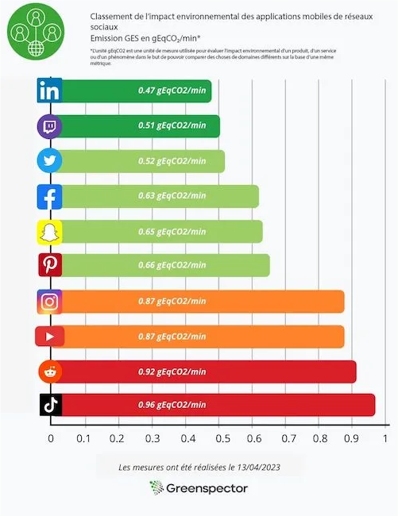
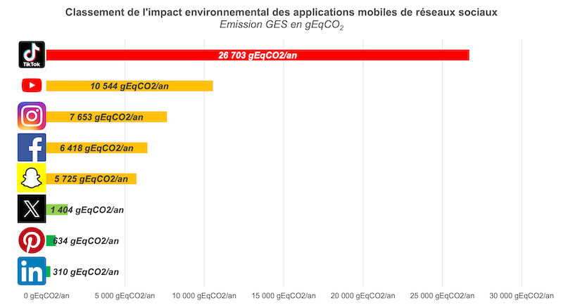

## Utilisation des réseaux sociaux par les Français.

D'après le [rapport France 2024 "We are social"](https://wearesocial.com/fr/blog/2024/01/digital-2024/), les français sont de plus en plus connectés avec plus de 97% de la population de 16-64 ans qui possèdent un smartphone. D'année en année ce chiffre ne fait qu'augmenter (+1% par rapport à 2023). L'un de leurs principaux usages qui en est fait est l'utilisation des plateformes de réseaux sociaux. 78% des français les utilisent régulièrement et se rendent en moyenne sur environ 6 plateformes différentes par mois. Le trio des plateformes les plus plébiscitées est Facebook, WhatsApp et Instagram.

Bien que de plus en plus connectés et utilisateurs de réseaux sociaux, les français ont moins passé de temps sur ces plateformes que l'année dernière avec 1h48 par jour soit 7 minutes de moins. Malheureusement, cela cache beaucoup de disparités. La plateforme TikTok bat tous les records cette année avec un temps moyen passé par mois sur l'application de 38h38 par ses utilisateurs actifs, soit plus de 12% d'augmentation! Quand on connaît l'algorithme qui se cache derrière cette application et la proportion d'adolescents de 13-17 ans (28%) qui utilisent cette plateforme, cela fait peur!

## Impact des réseaux sociaux sur l’environnement

En me basant sur la technique utilisée, et documentée, par [Greenspector](https://greenspector.com/fr/quelle-empreinte-environnementale-pour-les-applications-reseaux-sociaux-edition-2023/) pour évaluer l'impact environnemental en 2023, je vous actualise les chiffres pour 2024, en prenant en hypothèse que les éditeurs de réseaux sociaux n'ont pas modifié l'efficacité de leur plateforme.

### Parcours utilisateur évalué par Greenspector

Un seul et même parcours a été utilisé pour mesurer l'impact environnemental des plateformes:
- Etape 1 : lancement de l’application 
- Etape 2 : lecture du fil d’actualité sans défilement (30 sec) 
- Etape 3 : défilement du fil d’actualité avec des pauses intercalées.  
- Etape 4 : mise en arrière-plan de l’application (30 sec)

### Résultats de l'évaluation du parcours utilisateur

D'après Greenspector, LinkedIn est l'application la moins impactante de la liste, avec un très faible volume de données échangées entre le matériel utilisateur et les serveurs, et une faible consommation énergétique (13 mAh) soit 15% de moins par rapport aux autres applications évaluées.
TikTok arrive en bonne dernière position des tests réalisés. Elle est très énergivore à son lancement avec 22 mAh consommés. Sa consommation de données est phénoménale (environ 5 Mo) puisqu'elle précharge toutes les vidéos et photos pendant 30 secondes après son lancement pour une utilisation hors ligne.


Les paramètres de Greenspector pour calculer l'impact environnemental de leur parcours utilisateur sont :
- trois itérations de mesure de la consommation en énergie, en mémoire et en échange de données et de mesure du temps de réponse sur Greenspector Test Runner avec un smartphone en local (Samsung 10, Android 10, Réseau WiFi, Luminosité à 50%);
- les utilisateurs sont localisés en France, accèdent via leur smartphone aux services proposés par des serveurs d'architecture complexe  répartis dans le monde (à défaut d’avoir les informations pour chacune des applications).


### Projection sur un an de l'impact environnemental 

Quand on projette l’impact environnemental de l'usage annuel sur chaque application de réseaux sociaux, nous constatons une énorme variation entre le moins impactant (LinkedIn - 310g équivalent CO2) et le plus impactant (TikTok - 26,7kg équivalent CO2). 

Un français, utilisateur régulier de l'application TikTok, a un impact climatique annuel équivalent à rouler avec une voiture thermique sur 123km. Sachant que TikTok totalise près de 21 millions d'utilisateurs français actifs en 2024 (source: [digitiz](https://digitiz.fr/blog/statistiques-tiktok/)), l'usage de TikTok par les français en 2024 correspond à un équivalent de **64 000 tours du monde** en voiture! A titre de comparaison, les français parcourent 1000 tours du monde en voiture en utilisant LinkedIn en 2024.

Un effort doit vraiment être fait par les éditeurs de ces applications pour réduire cet impact vertigineux. Nous devons aussi questionner un peu nos usages concernant ces applications. Est-ce vraiment utile?


L’Ademe propose un convertisseur en ligne [Impact CO2](https://impactco2.fr) pour fournir une représentation de ces nombres barbares (poids en équivalent CO2) compréhensible pour tous. Sont incluses les émissions directes, la construction des véhicules (fabrication, maintenance et fin de vie) et la production et distribution de carburant et d’électricité. La construction des infrastructures (routes, rails, aéroports…) n’est pas incluse dans ce calcul.


