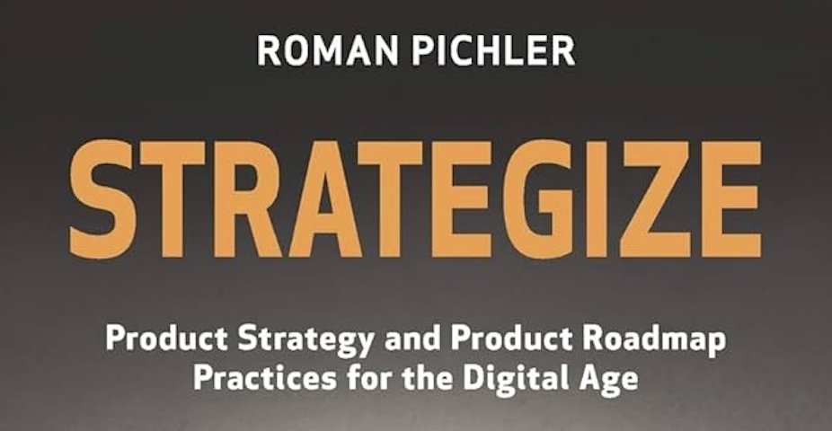

> De manière générale, tous les modèles sont erronés, mais certains sont utiles.
>
> – Georges E.P. Box

Comme je l'enseigne à tous les responsables produit débutant pour lesquels j'introduis la gestion de produit, il est intéressant d'utiliser des modèles comme ceux de [Roman Pichler](https://www.linkedin.com/in/romanpichler/) car ils amènent un cadre et une démarche qui guide dans la mise en oeuvre d'une approche produit. Mais ils restent des modèles qu'il faudra certainement adapter aux contextes dans lesquels ils sont appliqués.

## Approche Produit

Roman Pichler décompose son approche Produit en 5 artéfacts, du plus stratégique au plus tactique:
- La **vision produit** décrit la raison ultime pour laquelle le produit est créé;
- La **stratégie produit** indique comment la vision sera réalisée;
- La **feuille de route du produit** indique comment la stratégie sera mise en œuvre;
- Le **backlog du produit** contient les détails nécessaires au développement du produit tel que décrit dans la feuille de route, y compris les epics et les user stories
- L'**objectif de sprint** décrit le but d'un sprint et indique pourquoi il cela vaut la peine d'entreprendre ce sprint


Pour en savoir plus sur l'approche en gestion de produit de Roman Pichler, n'hésitez pas à lire son [livre](https://www.amazon.fr/Strategize-Product-Strategy-Roadmap-Practices/dp/0993499201) et à consulter son [blog](https://www.romanpichler.com).


## Product vision board

Ce cartouche vous aide à décrire, visualiser et valider la vision et la stratégie de votre produit. Il permet d'identifier le groupe cible, les besoins, les caractéristiques principales et les objectifs de l'entreprise. La vision ainsi décrite devient l'étoile polaire de l'équipe Produit qui travaille pour remplir cette vision.

Par expérience, j'utilise des ateliers de type [User role modeling](https://www.scrum.org/resources/blog/user-role-modeling-product-backlog-management) et [Impact mapping](https://www.impactmapping.org) pour définir ce cartouche. C'est extrêmement efficace!


Téléchargez le cartouche Product Vision Board


## Goal-oriented product board

Contrairement aux feuilles de route traditionnelles basées sur les caractéristiques, la GO product roadmap est orientée vers les objectifs. Ses objectifs décrivent des résultats ou des avantages tels que l'acquisition, l'activation et la fidélisation des utilisateurs, qui constituent l'épine dorsale du plan. Cela permet de passer d'un débat sur les fonctionnalités à la création de valeur, à la prise de décisions d'investissement intelligentes et à l'alignement des parties prenantes et des équipes de développement. Cette roadmap est un document très simple et efficace pour communiquer et échanger avec vos parties prenantes.

Une approche [Impact mapping](https://www.impactmapping.org) permet de remplir efficacement ce cartouche.


Téléchargez le cartouche GO Product Roadmap


## Sprint goal board

Un objectif de sprint, s'il est correctement appliqué, énonce le résultat de l'itération et guide le travail de l'équipe de développement. Malheureusement, de nombreuses équipes n'utilisent pas du tout d'objectifs de sprint ou les appliquent pour énoncer les histoires à mettre en œuvre plutôt que la raison d'être de l'itération. Le cartouche de Roman Pichler vous aide à formuler des objectifs de sprint efficaces en répondant aux trois questions suivantes : Pourquoi réaliser le sprint ? Comment allez-vous atteindre le résultat souhaité ? Et comment saurez-vous que l'objectif a été atteint ?


Téléchargez le cartouche Sprint Goal
