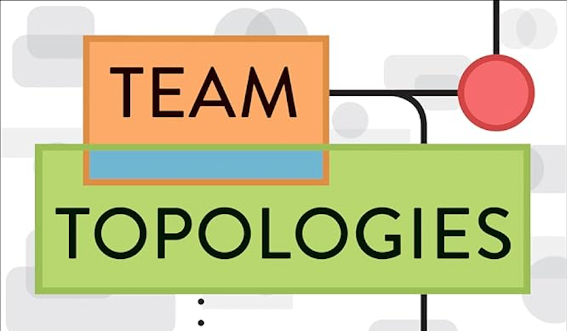

In 2021, as part of our book club at [SoKube](https://www.sokube.io), [Laurent Speyser](https://www.linkedin.com/in/laurent-speyser-33ba72b6/) suggested we read "Team topologies" by [Matthew Skelton](https://www.linkedin.com/in/matthewskelton/) and [Manuel Pais](https://www.linkedin.com/in/manuelpais/). It was a real revelation, and shed light on the dysfunctions I had encountered in various companies during my coaching work.

> "Organizations which design systems (in the broad sense used here) are constrained to produce designs which are copies of the communication structures of these organizations."
>
> – Melvin E. Conway

**Conway's Law** is well known to employees of companies producing digital products. Matthew and Manuel invite us to reverse this law and build high-performance teams with the right interactions to build a digital product as efficiently as possible, based on a team-first approach that emphasises clear limits and expectations in terms of communication and responsibilities within and between teams.

Without revealing the full content of the book, you will find below a few of the points covered.

## Team topologies

There are 4 types of team:
- **stream-aligned team**: in charge of delivering the company's value to its customers, organised in such a way as to be able to make rapid decisions in complete autonomy; 
- **platform team**: in charge of reducing the cognitive load of atream-aligned teams by providing them with automated services;
- **enabling team**: responsible for helping other teams to increase their knowledge and skills in a subject in which it has expertise (e.g. test automation);
- **complicated sub-system team**: in charge of reducing the cognitive load of value stream-oriented teams or platform teams by providing them with services that abstract the complexity of a subject requiring in-depth expertise.

## Interaction topologies

There are 3 types of interaction:
- **collaboration**: encourages collective intelligence to create new services, but costs an organisation a lot in terms of coordination and clarity of responsibilities; 
- **facilitation**: mainly used by enabling teams to pass on knowledge and know-how to a team;
- **X-as-a-service**: the target for any company in terms of team interactions, by making interactions between teams explicit; one team provides a service that another team consumes.


To find out more, read the book [Team topologies](https://www.amazon.com/Team-Topologies-Organizing-Business-Technology/dp/1942788819) and visit the associated [website](https://teamtopologies.com/).
